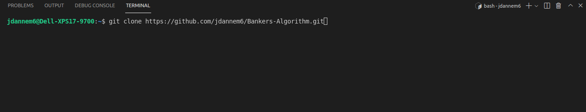
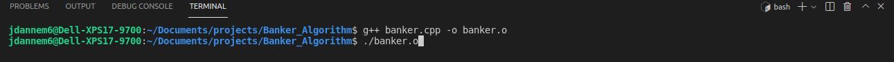
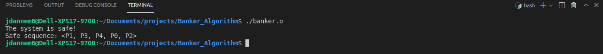

# Bankers-Algorithm
### CS33211: Operating Systems
An implementation of Banker's Algorithm: a classic problem in avoiding operating system deadlocks

## Banker's Algorithm
In computer science, there is great emphasis placed on maximizing computer throughput. In fact, many, many systems, including both software and hardware, have been designed, tested, and extensively optimized to maximize the number of instructions a computer can perform in a short period of time. Unfortunately, there are many events that can occur within a computer which can drastically decrease its throughput. One such example is deadlock. Generally, deadlock is the event that occurs when a set of processes are waiting for a condition that will never be met. One specific example takes place when processes are waiting on one another to finish, mutually assuring that none of the deadlocked processes will ever reach termination. 

The Banker's Algorithm is a deadlock avoidance alogorithm which provides insight into whether a given system can maintain in a safe, deadlock-free state, or whether it will enter an unsafe state, where deadlock is possible. Specifically, this algorithm uses resource information, such as which and how many resources are allocated to or requested by a given process, to determine whether deadlock can be avoided in a given system. 

### Prerequisites
This project was tested on a system consisting of a g++ compiler, a gdb debugger, and Ubuntu 20.04.2 LTS.

### Installation
1. Clone the git repository

2. Compile the banker.cpp program and run the resulting object file

## Example Output

